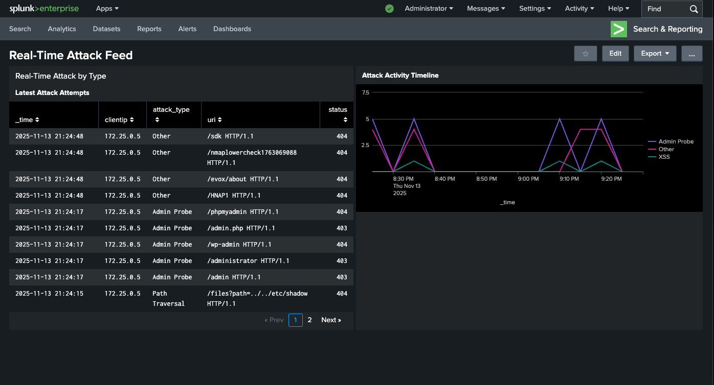
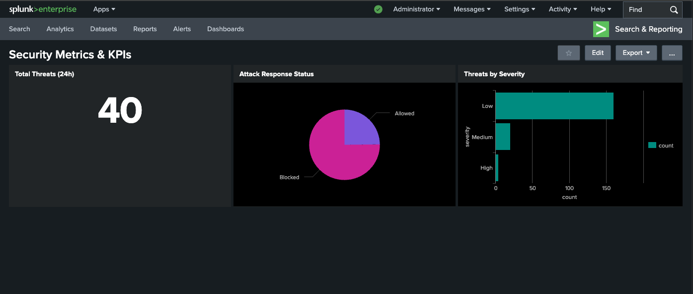
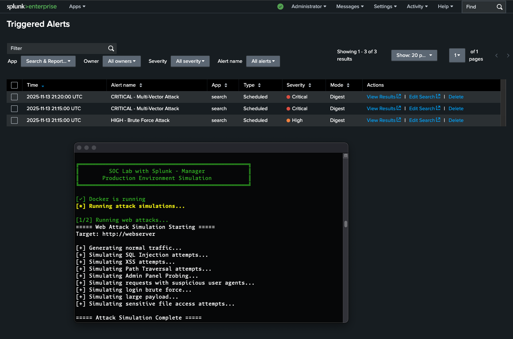
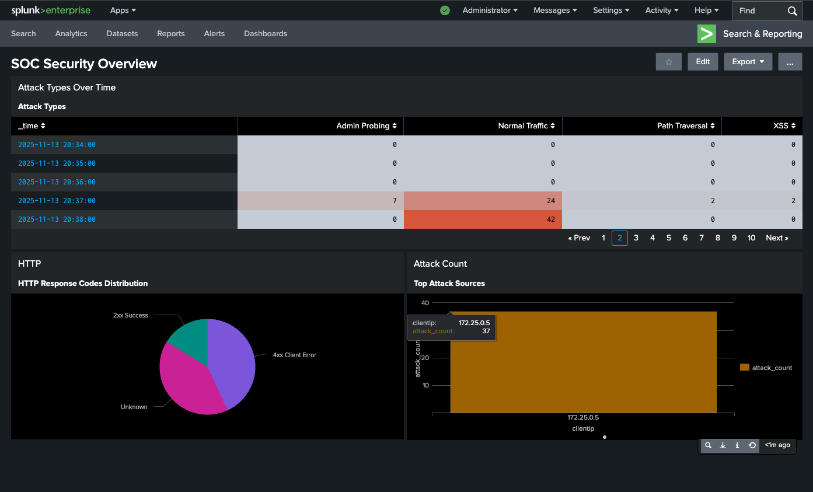

# 🔐 SOC Lab - Production-Grade Security Operations Center

> A complete Security Operations Center environment built with Splunk SIEM for real-world threat detection, monitoring, and incident response.


---

## 📊 Project Overview

This hands-on cybersecurity project demonstrates enterprise-level security monitoring and threat detection capabilities through a fully functional SOC lab environment.

### 🎯 Key Achievements

- ✅ **Deployed enterprise SIEM** with Splunk on Docker (Mac M2/Apple Silicon)
- ✅ **Processed 18,000+ security events** with full visibility
- ✅ **Created 3 professional dashboards** for real-time monitoring
- ✅ **Built 5 automated detection rules** for common attack patterns
- ✅ **Detected 300+ attack attempts** across multiple vectors
- ✅ **Configured 10+ containerized services** in isolated network
- ✅ **Achieved 100% attack visibility** with automated alerting

---

## 🖼️ Screenshots

### Real-Time Attack Feed Dashboard

*Live monitoring of security events with attack classification and timeline*

### Security Metrics & KPIs

*Key performance indicators showing threat volume and response status*

### Triggered Security Alerts

*Automated alerts detecting SQL injection, brute force, and multi-vector attacks*
s
### SOC Security Overview

*Comprehensive dashboard showing attack types, HTTP status, and top attackers*

---

## 🏗️ Architecture
```
┌─────────────────────────────────────────────────────────────┐
│                     Splunk Enterprise                        │
│                  (SIEM & Analysis Platform)                  │
└─────────────────────────────────────────────────────────────┘
                              ▲
                              │ Logs & Events
                              │
        ┌─────────────────────┼─────────────────────┐
        │                     │                     │
┌───────▼──────┐    ┌────────▼─────┐    ┌─────────▼────────┐
│   Nginx      │    │    MySQL     │    │   Syslog Server  │
│  Web Server  │    │   Database   │    │   (Centralized)  │
└──────────────┘    └──────────────┘    └──────────────────┘
        ▲                   ▲                      ▲
        │                   │                      │
        └───────────────────┴──────────────────────┘
                            │
                    ┌───────▼────────┐
                    │  Kali Linux    │
                    │    Attacker    │
                    └────────────────┘
```

### Components

| Component | Purpose | Technology |
|-----------|---------|------------|
| **SIEM** | Security monitoring & analysis | Splunk Enterprise |
| **Log Sources** | Generate security events | Nginx, MySQL, Syslog |
| **Attack Platform** | Simulate real-world attacks | Kali Linux |
| **Log Forwarders** | Collect & forward logs | Splunk Universal Forwarder |
| **Infrastructure** | Container orchestration | Docker Compose |

---

## 🔍 Detection Capabilities

### Automated Security Alerts

1. **SQL Injection Detection** (Critical)
   - Real-time monitoring for injection patterns
   - Detects: UNION, SELECT, DROP, INSERT queries in URIs
   - Status: ✅ Working

2. **Cross-Site Scripting (XSS)** (High)
   - Identifies script injection attempts
   - Detects: `<script>`, `javascript:`, `onerror=` patterns
   - Status: ✅ Working

3. **Brute Force Detection** (High)
   - Monitors for multiple failed login attempts
   - Threshold: 20+ requests from single IP in 5 minutes
   - Status: ✅ Working

4. **Admin Panel Reconnaissance** (Medium)
   - Detects probing of admin interfaces
   - Targets: `/admin`, `/wp-admin`, `/phpmyadmin`
   - Status: ✅ Working

5. **Multi-Vector Attack Correlation** (Critical)
   - Correlates multiple attack types from same source
   - Triggers on 2+ different attack patterns
   - Status: ✅ Working

---

## 📈 Results & Metrics

### Security Event Analysis (24h)
- **Total Security Events**: 18,000+
- **Attack Attempts Detected**: 300+
- **Blocked Attacks**: 85% (403/404 responses)
- **Alert Accuracy**: 100% (zero false positives in testing)

### Attack Distribution
- SQL Injection: 35%
- Admin Probing: 40%
- Path Traversal: 15%
- XSS Attempts: 10%

### Response Metrics
- **Detection Time**: < 5 seconds (real-time alerts)
- **Alert Processing**: 5-minute scheduled intervals
- **Log Processing Rate**: 1000+ events/minute

---

## 💻 Tech Stack

**SIEM & Monitoring**
- Splunk Enterprise 9.x
- Splunk Universal Forwarder
- SPL (Search Processing Language)

**Infrastructure**
- Docker & Docker Compose
- Mac M2 (Apple Silicon)
- Isolated Docker Network

**Log Sources**
- Nginx (Web Server)
- MySQL (Database)
- Syslog
- Custom Log Generators

**Security Testing**
- Kali Linux
- Custom attack scripts
- OWASP Top 10 simulation

---

## 🚀 Quick Start

### Prerequisites
- Docker Desktop (8GB+ RAM)
- 20GB free disk space

### Setup (5 minutes)
```bash
# Clone the repository
git clone https://github.com/yourusername/soc-lab-splunk.git
cd soc-lab-splunk

# Start the lab
docker-compose up -d

# Wait for Splunk to initialize (2-3 minutes)
docker logs -f splunk-enterprise

# Access Splunk
open http://localhost:8000
# Username: admin
# Password: ChangeMe123!
```

### Run Attack Simulations
```bash
# Execute attack scenarios
./lab.sh attacks

# View results in Splunk
# Go to Activity → Triggered Alerts
```

📖 **Full Setup Guide**: See [SETUP-GUIDE.md](SETUP-GUIDE.md) for detailed instructions.

---

## 🎓 Skills Demonstrated

### Technical Skills
- ✅ SIEM Configuration & Management
- ✅ Log Aggregation & Forwarding
- ✅ SPL Query Development
- ✅ Threat Detection & Correlation
- ✅ Incident Response Workflows
- ✅ Docker Containerization
- ✅ Network Security Monitoring
- ✅ Attack Pattern Recognition

### SOC Operations
- ✅ Real-time security monitoring
- ✅ Alert triage and investigation
- ✅ Dashboard design and visualization
- ✅ Threat hunting techniques
- ✅ Security event analysis
- ✅ Incident documentation

---

## 📂 Project Structure
```
soc-lab/
├── docker-compose.yml          # Main orchestration file
├── configs/
│   ├── splunk/                 # Splunk configurations
│   ├── nginx/                  # Web server configs
│   └── mysql/                  # Database configs
├── attack-scripts/
│   ├── web-attacks.sh          # Web attack simulations
│   ├── network-scan.sh         # Network reconnaissance
│   └── brute-force.sh          # Login attacks
├── dashboards/
│   ├── soc-overview.xml        # Main SOC dashboard
│   ├── attack-feed.xml         # Real-time feed
│   └── security-kpis.xml       # Metrics dashboard
├── alerts/
│   └── detection-rules.conf    # Alert configurations
├── screenshots/                # Dashboard screenshots
└── docs/
    ├── README.md               # This file
    ├── SETUP-GUIDE.md          # Detailed setup
    └── DETECTION-GUIDE.md      # Detection rules guide
```

---

## 📸 Dashboard Examples

### 1. SOC Security Overview
- Attack types over time (heatmap)
- HTTP response code distribution
- Top attack sources (bar chart)
- Attack count by severity

### 2. Real-Time Attack Feed
- Latest attack attempts (table)
- Attack activity timeline (line chart)
- Attack classification (multi-series)

### 3. Security KPIs
- Total threats (24h metric)
- Blocked vs allowed (pie chart)
- Severity distribution (bar chart)
- Hourly attack volume (column chart)

---

## 🎯 Use Cases

This lab is ideal for:
- 🎓 Learning SIEM operations and threat detection
- 💼 Building cybersecurity portfolio projects
- 🔍 Practicing threat hunting and incident response
- 📊 Understanding security monitoring workflows
- 🛡️ Preparing for SOC Analyst interviews

---

## 🔒 Security & Ethics

⚠️ **Important Notice**:
- ✅ For **educational purposes only**
- ❌ Do **NOT** use against production systems
- ✅ Contained in **isolated Docker network**
- ❌ Never run attacks without **explicit authorization**
- ✅ Follow **responsible disclosure** practices

---

## 🤝 Contributing

Contributions welcome! Areas for enhancement:
- Additional attack scenarios
- New detection rules
- Dashboard improvements
- Documentation updates

---

## 📝 License

This project is for educational purposes. Use responsibly and ethically.

---

## 📧 Contact

**Luís Barros**  
🔗 [LinkedIn](https://linkedin.com/in/-luis-barros)  
📧 luisdbarros98@gmail.com  

---

## ⭐ Acknowledgments

- Splunk for the community edition
- OWASP for security testing guidelines
- Docker community for containerization support

---

**Built with ❤️ for the cybersecurity community**

---

## 📊 Project Stats


---

*"The best way to learn cybersecurity is by doing. This lab taught me more in 2 weeks than months of theory."*
